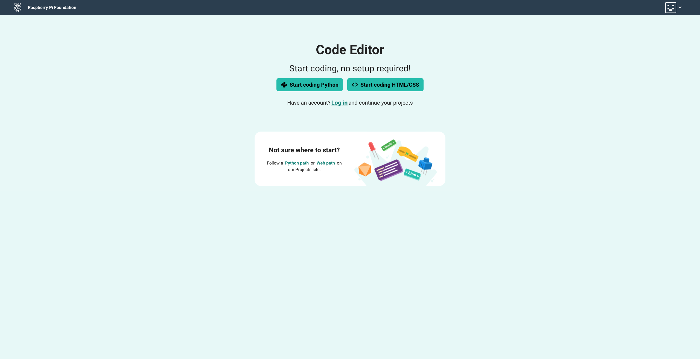
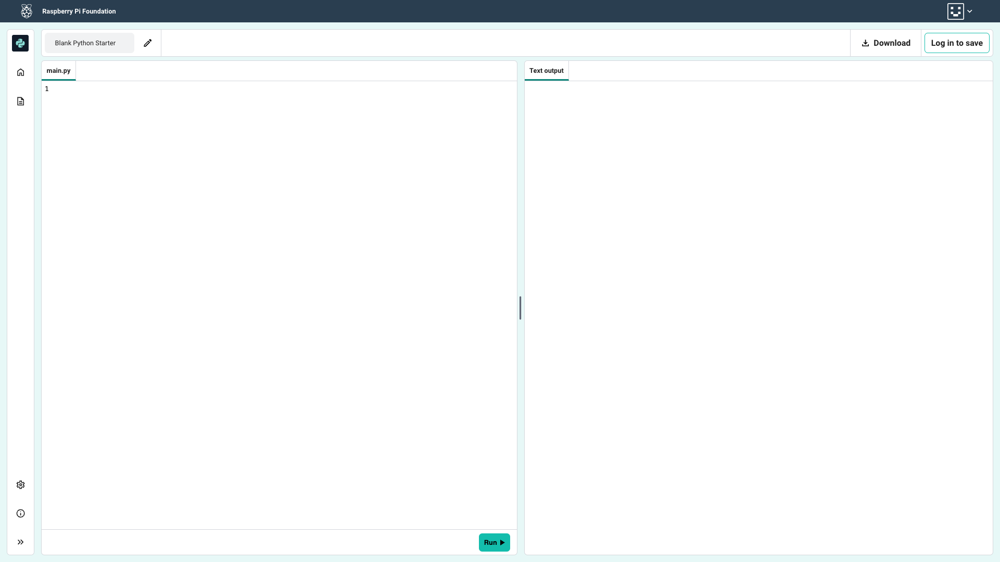
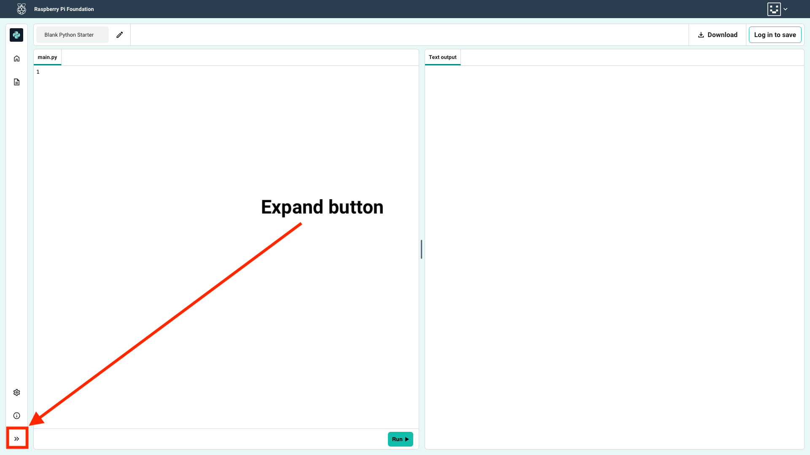

## Code Editor homepage

Open the [Code Editor](https://editor.raspberrypi.org/en/){:target="_blank"}.

### Start coding Python!

--- task ---

Click on the `Start coding Python` button.

--- /task ---

--- collapse ---

---
title: Log in
---

If you have a Raspberry Pi account, you can log in to save your projects.

You can log in from the link in the middle of the homepage screen:

...or from the Account menu at the top right:

--- /collapse ---

The Code Editor will open with a blank project.

--- task ---

The expand button is at the bottom left of the Code Editor. 

Click it to show the Sidebar panel.

The Project files panel will open.

The blank project has the file `main.py`.

--- /task ---
