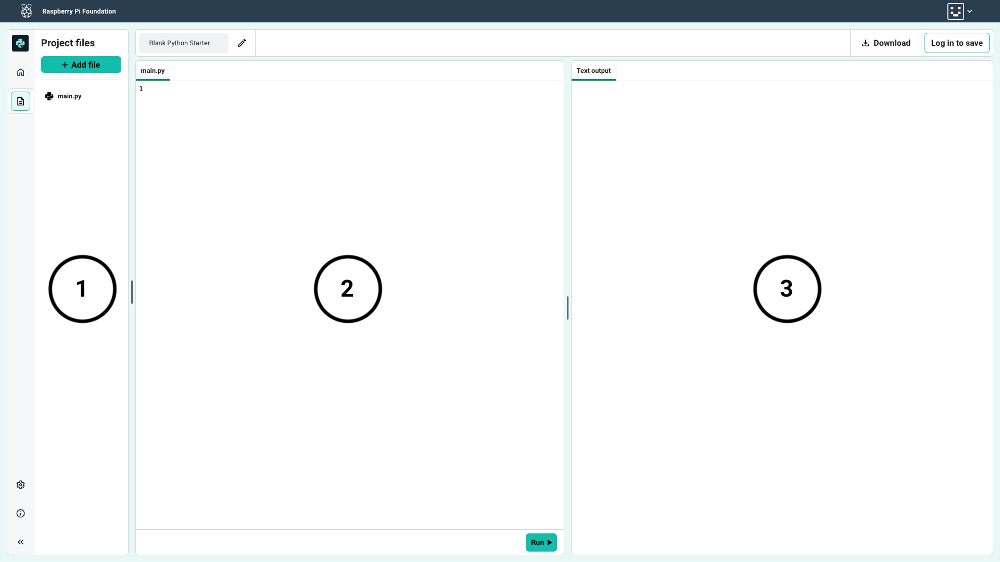
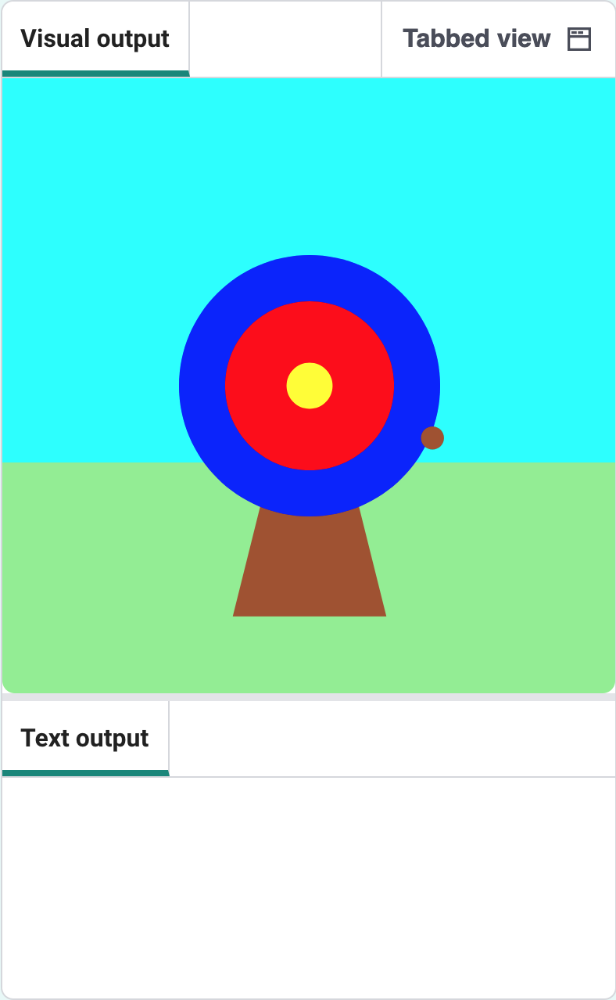
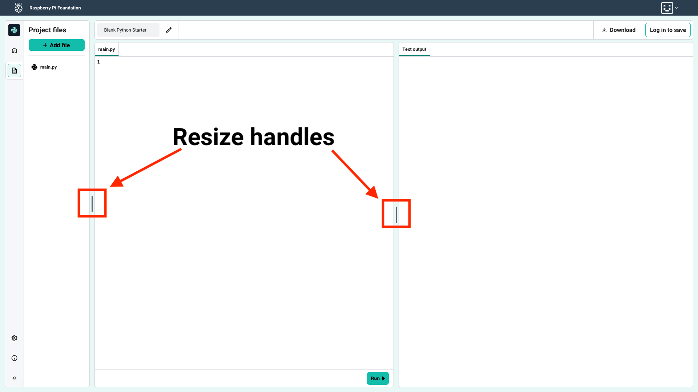
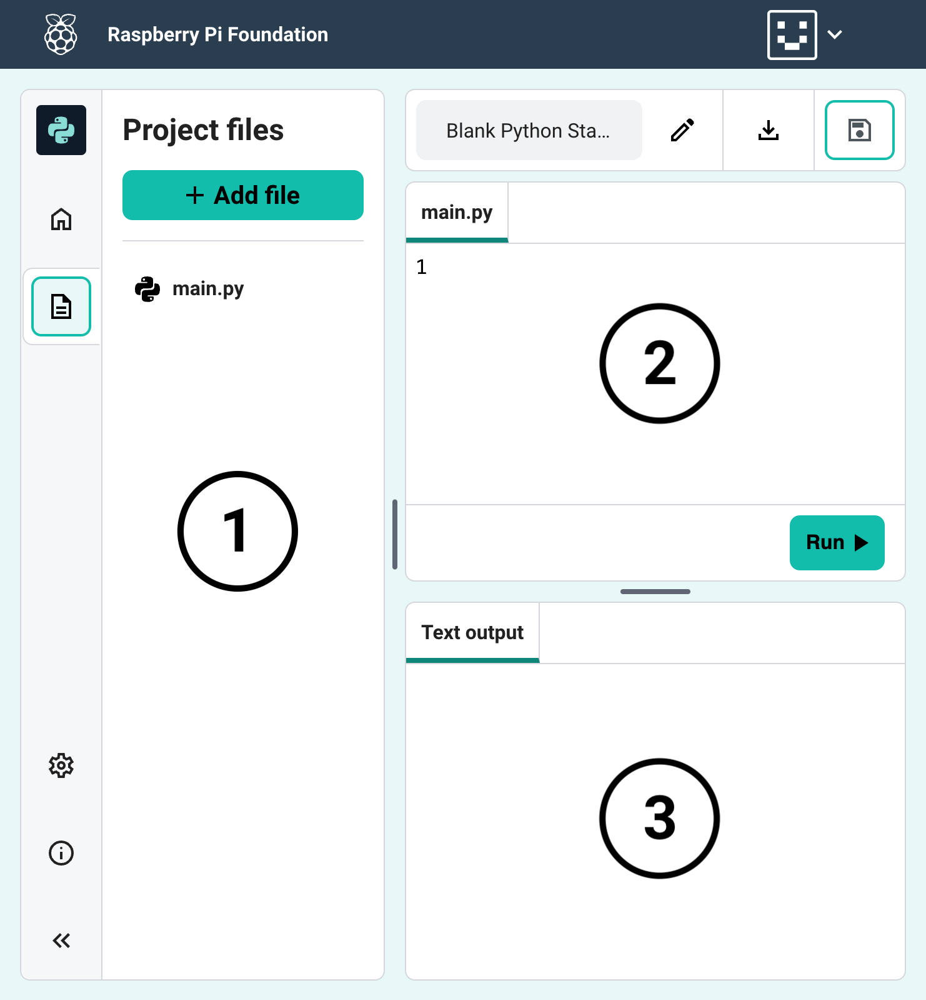

## Editor tour

This screenshot shows the three main panels:
1) The Sidebar panel on the left
2) The Code panel in the middle
3) The Preview panel on the right

The Preview panel shows Text output by default. If your project uses graphical features, the Preview panel will also include a Visual output.

{:width="300px"}

### Resize the panels

You can resize the panels using the handles.

### Adaptive layout

The layout will adapt if you resize your browser window, or if you are working on a device with a smaller screen size.

This screenshot shows the three main panels in an adapted layout, with the Preview panel vertically below the Code panel.

### Project bar

The project bar is at the top of the page and shows:

+ The name of your project, with an edit button, so you can change the project name.
+ A button to let you download your project files.
+ A link to log in. This changes to ‘save’ when you are logged in.
