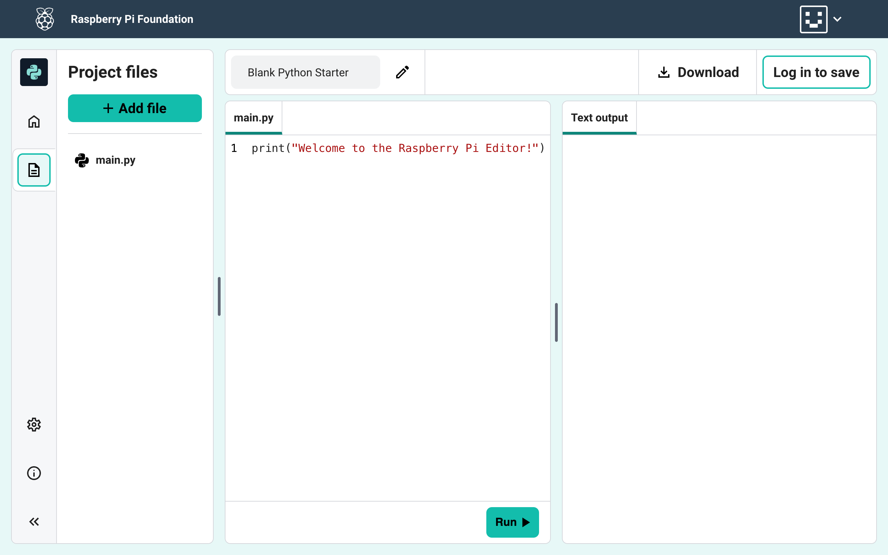
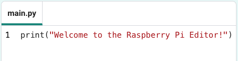
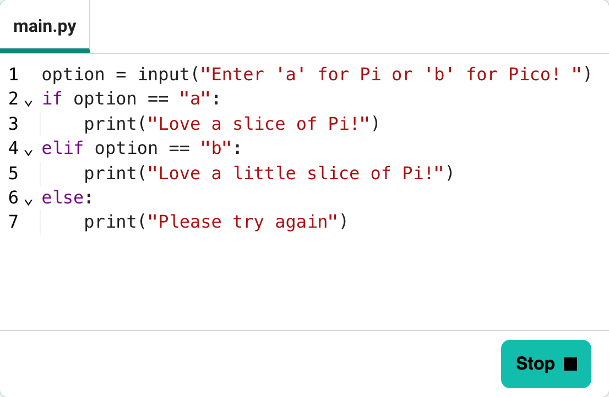
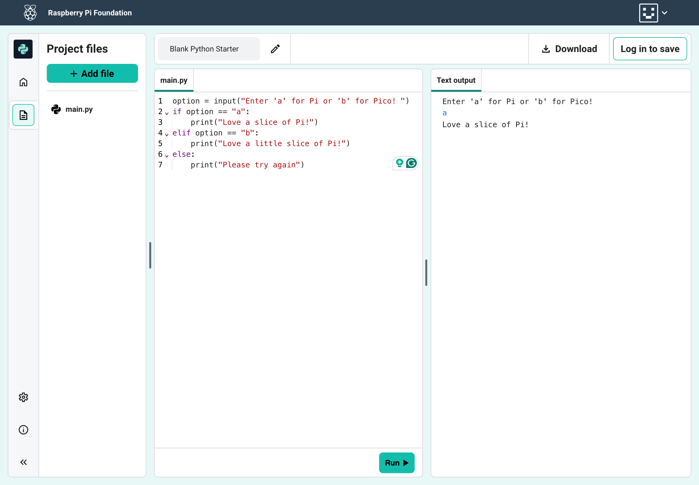

## The Code and Preview panels

The file name is at the top of the panel. 

In this example, the file name is `main.py`.

The Code panel includes the following features: 

--- collapse ---
---
title: Line numbering
---

When you type new lines of code in the Code Editor, line numbers will be added for you. 

Line numbering helps you keep track of where you are in your project and helps you work with others on your code.

--- /collapse ---

--- collapse ---
---
title: Syntax highlighting
---

Syntax highlighting improves the readability of code by applying colours and styles to different elements based on the language's syntax (the 'rules' of the language). 

It helps distinguish different parts of the code and is a valuable tool for developers, making code more accessible.

In this example, you can see that the Code Editor highlights each opening and closing bracket. A string value is highlighted in red.

--- /collapse ---

--- collapse ---
---
title: Indentation
---

The Code Editor will automatically format your code by adding spaces to create a visual structure.

Auto-indentation is a useful feature, as indentation affects how Python code is interpreted.

In this example, you can see that the conditional statements are indented.

--- /collapse ---

--- task ---

### Try it

Add this code to your project.

--- code ---
---
language: python
filename: main.py
line_numbers: true
line_number_start: 1
line_highlights:
---

option = input("Enter 'a' for Pi or 'b' for Pico! ")
if option == "a":
    print("Love a slice of Pi!")
elif option == "b":
    print("Love a little slice of Pi!")
else:
    print("Please try again")

--- /code ---

**Notice** the line numbering, syntax highlighting, and indentation.

**Test:** 

+ Click the **Run** button.
+ The text output will show in the Preview panel.

--- /task ---

--- print-only ---

--- /print-only ---
